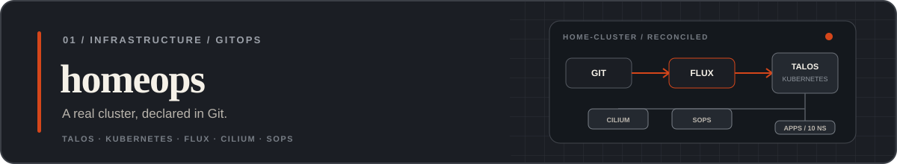
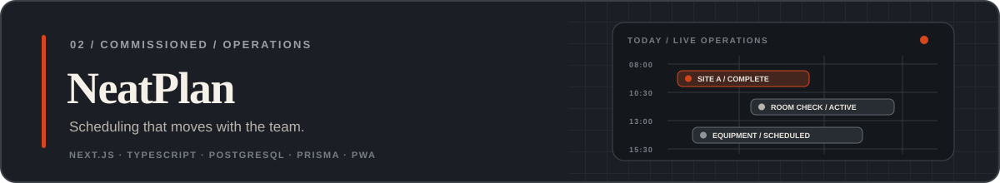

<picture>
  <source media="(prefers-color-scheme: dark)" srcset="./assets/profile-dark.svg">
  <source media="(prefers-color-scheme: light)" srcset="./assets/profile-light.svg">
  
</picture>

  <a href="https://andrei.iacob.co.uk"><strong>Portfolio ↗</strong></a>&nbsp;&nbsp;·&nbsp;&nbsp;
  <a href="https://linkedin.com/in/andreigiacob">LinkedIn ↗</a>&nbsp;&nbsp;·&nbsp;&nbsp;
  <a href="mailto:andrei@iacob.co.uk">Email ↗</a>&nbsp;&nbsp;·&nbsp;&nbsp;
  <a href="https://git.iacob.co.uk/andrei">Forgejo ↗</a>

Software developer working across product, infrastructure and operations. I build tools for real teams and own the path beneath them, from the first workflow to the production cluster.

Based in Bury St Edmunds, UK, while completing a BSc in Computer Science at Anglia Ruskin University.

## Shipping now

| `01 / VISITOR MANAGEMENT` | `02 / FLEET MANAGEMENT` | `03 / SWISH` |
|:---|:---|:---|
| Multi-site check-in, contractor validation and Android kiosk workflows | Live vehicle tracking, driver apps and customer-facing operations tools | Swipe-first fashion discovery for iOS, currently in TestFlight |

## Featured work

Declarative infrastructure for a Talos Linux Kubernetes cluster on Proxmox, continuously reconciled by Flux. Around 96 app units across 10 namespaces make this the platform I depend on, not a demo cluster. **[View repository ↗](https://github.com/andrei-iacobb/homeops)**

 

Commissioned cleaning-operations software that turns rooms, equipment and recurring schedules into a live mobile workflow for field teams. **[View repository ↗](https://github.com/andrei-iacobb/neatplan)**

## In the lab

| Project | What it does | Built with |
|:---|:---|:---|
| **[replicarr ↗](https://github.com/andrei-iacobb/replicarr)** | Approval-driven, bandwidth-friendly media replication for Sonarr and Radarr | Next.js, TypeScript, Prisma, SQLite |
| **[sharerr ↗](https://github.com/andrei-iacobb/sharerr)** | Invite-only Plex sharing with scoped access, expiring PINs and in-browser playback | Next.js, TypeScript, PostgreSQL, Plex |
| **[website ↗](https://github.com/andrei-iacobb/website)** | The self-hosted portfolio behind [andrei.iacob.co.uk](https://andrei.iacob.co.uk) | Next.js, TypeScript, Redis, Kubernetes |

## Build → run → operate

| `BUILD / PRODUCT` | `RUN / PLATFORM` | `OPERATE / SYSTEMS` |
|:---|:---|:---|
| Next.js, React, TypeScript, PostgreSQL, Prisma | Kubernetes, Talos Linux, Flux CD, Docker | Proxmox, Cilium, Cloudflare, Linux |

I prefer owning the whole path: requirements, interface, backend, deployment and the boring-but-important production details.

## Let's build something

Have a workflow that has outgrown spreadsheets, or infrastructure that needs simplifying? [andrei@iacob.co.uk](mailto:andrei@iacob.co.uk)
