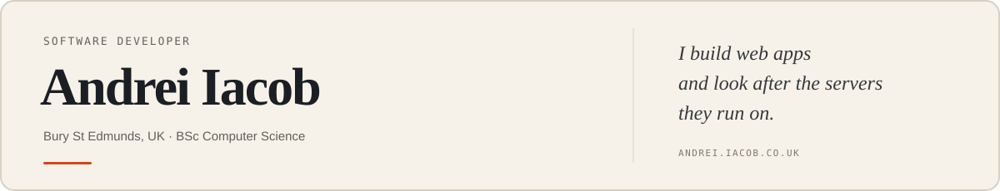

<picture>
  <source media="(prefers-color-scheme: dark)" srcset="./assets/profile-dark.svg">
  <source media="(prefers-color-scheme: light)" srcset="./assets/profile-light.svg">
  
</picture>

[Portfolio](https://andrei.iacob.co.uk) · [LinkedIn](https://linkedin.com/in/andreigiacob) · [Email](mailto:andrei@iacob.co.uk) · [Forgejo](https://git.iacob.co.uk/andrei)

I'm a software developer and Computer Science student. I tend to own a project end to end, from the first commit to the box it runs on. These days that mostly means Next.js, PostgreSQL and a Kubernetes cluster in my garage.

## Selected work

### [HomeOps](https://github.com/andrei-iacobb/homeops)

The Git repository that runs my homelab: Talos Linux on Proxmox, reconciled by Flux, with Cilium for networking and SOPS for secrets. It currently deploys around 96 applications across 10 namespaces.

Talos Linux · Kubernetes · Flux CD · Cilium · SOPS · Proxmox

### [NeatPlan](https://github.com/andrei-iacobb/neatplan)

A commissioned cleaning-management system for assigning work, tracking progress and giving staff a mobile-friendly schedule.

Next.js · TypeScript · PostgreSQL · Prisma · PWA

## Other projects

- **[Replicarr](https://github.com/andrei-iacobb/replicarr)** approves and copies selected films and series into lower-bandwidth Sonarr and Radarr libraries.
- **[Sharerr](https://github.com/andrei-iacobb/sharerr)** creates expiring, PIN-protected links for selected media, with playback in the browser.
- **[Portfolio](https://github.com/andrei-iacobb/website)** is the Next.js site running at [andrei.iacob.co.uk](https://andrei.iacob.co.uk).

## Current work

I'm currently building a multi-site visitor-management system, a fleet-management platform with driver apps, and Swish, a fashion-discovery app now in TestFlight.

## Tools

- **Applications:** TypeScript, Next.js, React, PostgreSQL, Prisma and Swift
- **Infrastructure:** Kubernetes, Talos Linux, Flux, Docker, Proxmox, Cilium and Linux

## Contact

If you need a custom internal tool or help simplifying self-hosted infrastructure, email [andrei@iacob.co.uk](mailto:andrei@iacob.co.uk).
